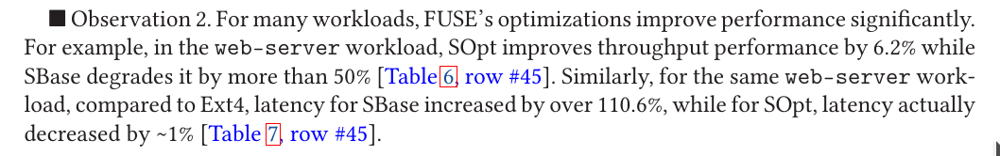
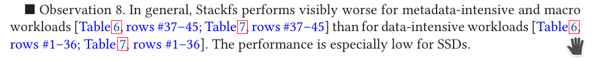
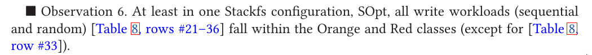

# FUSE performance notes

## TL;DR

FUSE is bad at: 

* **file creation;** 
* file read (esp. multithreaded); (multithreaded) random reads (32 thread, 1 file, SBase, HDD or SDD)
* metadata operations

## File creation is noticably slow

Using a FUSE filesystem vs in-kernel, creating 1000 files is noticably slower.

Vangoor19:

## Using FUSE optimizations can help (read operations in particular), but unoptimized is usually good (except metadata; except)

FUSE optimizations noticably improve (see Vangoor19, Table 6, HDD results): 

* files-rd-32th (file read, 32 threads)
* rnd-rd-32th-1f (random read, 32 threads, 1 file)

Conclusion: FUSE read operations benefit from using optimized FUSE calls, but for most others the gain is not that noticable.

Presumably this is mainly due to read performance.

## FUSE read and write perf. is usually reasonable; metadata operations are slow

So, metadata-intensive operations typically perform poorly. FUSE is likely optimized for read/write rather than metadata operations.

## FUSE write operations have high CPU overrhead

Table 8 also shows that FUSE write operations usually have high CPU overhead.

 

And in fact, this is basically true for SBase as well.